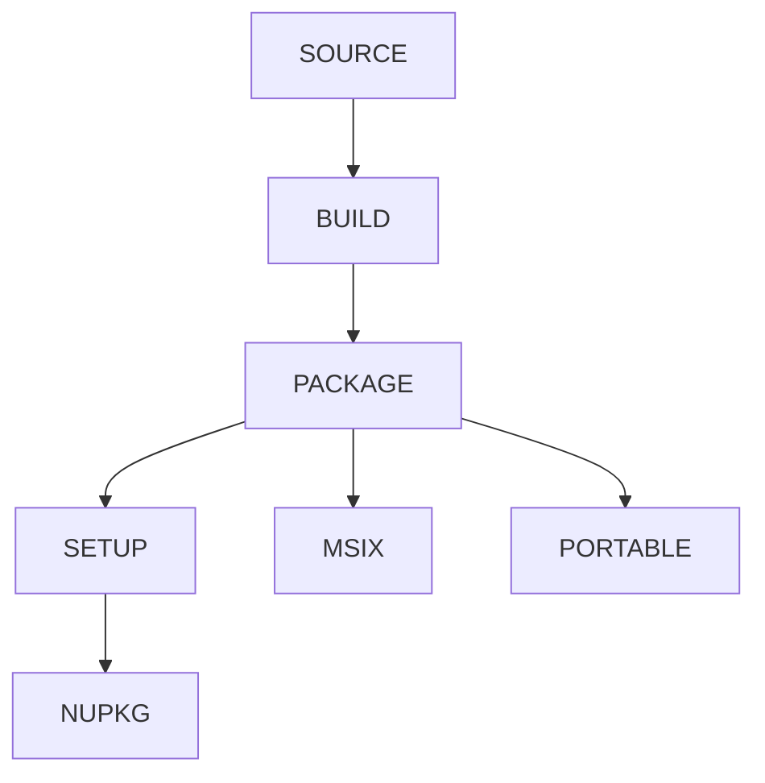

# 🛠️ bsys6

This repository should make it easy to build LibreWolf and various things
arround it, via Docker or directly on your system.

## Usage

```
bsys6 - The 6th generation LibreWolf Build System

Usage: bsys6 [command]

Commands:                                                                   | Artifacts:
  bootstrap       - Bootstrap the build system with mach
  build_docker    - Run the 'build' command inside Docker
  build_image     - Build the docker image used by 'build_docker'
  build           - Build LibreWolf (requires a prepared system)
  clean           - Remove the work directory (including source)
  clobber         - Clean the current source directory
  help            - Show this page
  msix            - Build a MSIX package for Windows                        | MSIX
  nupkg           - Build a .nupkg to be used for Chocolatey                | NUPKG
  package_docker  - Run the 'package' command inside Docker
  package         - Package LibreWolf into a zip/tarball                    | PACKAGE
  prepare         - Prepare the build enviroment and install dependencies
  release         - Publish all the various artifacts
                    (Should only be used in CI)
  run             - Start the built browser
  setup           - Build the installer for Windows with nsis               | SETUP
  source          - Download the latest LibreWolf source code into          | SOURCE
                    the working directory
  update          - Update the version cache
  portable    - Build a zip containing the LibreWolf Portable           | PORTABLE

Commands may be customized by setting the following environment variables:
  TARGET  - The target platform (available: linux windows; currently: linux)
  ARCH    - The target architecture (available: x86_64 arm64 i686; currently: x86_64)
  VERSION - The version of LibreWolf to build (default: latest)
  WORKDIR - The directory to use for temporary files (currently: /home/maltejur/.local/share/bsys6/work)

  You can also persist these settings by creating a file named "env.sh" in the
  same directory as this script, and setting the variables there, for example:

  '''
  export WORKDIR=/mnt/ssd2/bsys6-work
  '''
```

See `./bsys6 --help` for a probably more up-to-date version of this.

## Development

### Available commands



### Structure

| Directory          | Contents                                                                                                | Arguments                                        | How to include |
| ------------------ | ------------------------------------------------------------------------------------------------------- | ------------------------------------------------ | -------------- |
| `src/{command}.sh` | Commands that can be run by the user with `./bsys6/{command}.sh`. Can export new environment variables. | Via environment variable                         | With `source`  |
| `src/exports/*.sh` | Scripts that export environment variables, but shouldn't be run directly by the user.                   | Via environment variable                         | With `source`  |
| `src/utils/*.sh`   | Scripts that don't export environment variables and shouldn't be run directly by the user.              | Via environment variable or positional arguments | Run directly   |

## License

This Source Code Form is subject to the terms of the Mozilla Public License, v.
2.0. If a copy of the MPL was not distributed with this file, You can obtain one
at http://mozilla.org/MPL/2.0/.
